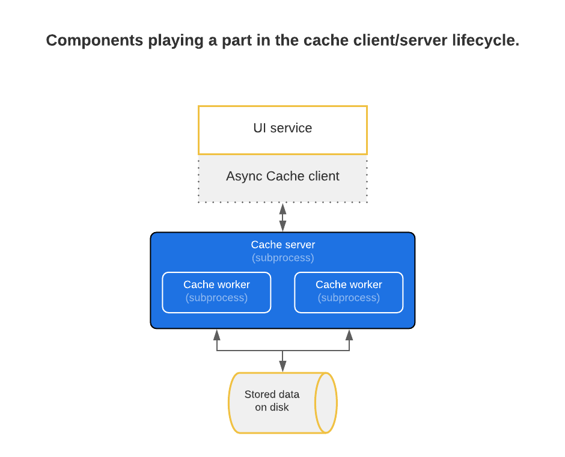
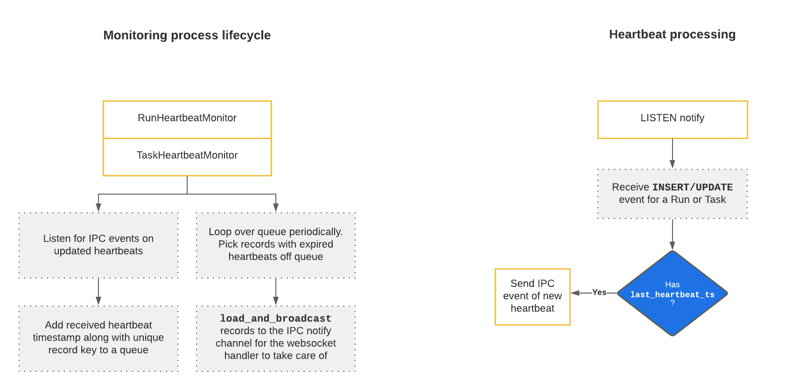
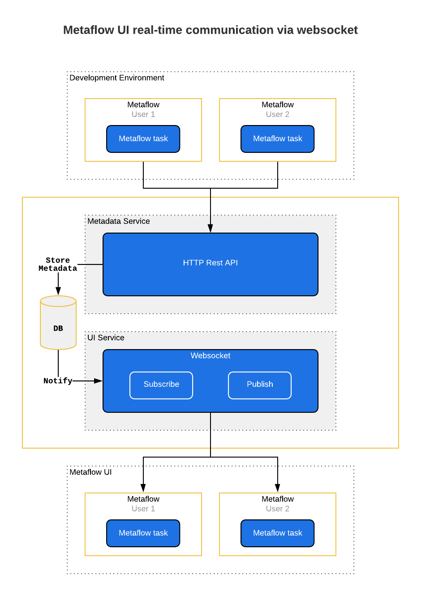

# Architecture documentation for UI Service

## Cache



The Cache system is split into three main components
  - [Async Cache client](#async-cache-client) (cache interface)
    - [CacheFuture](#cachefuture) (awaitable cache result)
  - [Cache server](#cache-server) (worker queueing)
  - [Cache worker](#cache-worker) (execution of cache requests)

### Async Cache Client

The Cache client is the interface for accessing cached content. It is responsible for setting up and starting the Cache server as a *subprocess*, setting the necessary configuration variables, such as maximum allowed diskspace and number of cache workers.

The cache client instance exposes a number of Cache Actions after the server subprocess has successfully started. These are the interface for accessing cached content. The response of a cache action is an awaitable `CacheFuture`.

#### CacheFuture

The inner workings of the cache future are best explained with an example. Take the following cache action

```python
  result = await cache_client_instance.GetArtifacts("s3://location")
```
the `result` will be a CacheFuture instance, which will check if all cache keys required by the request are present on disk (cache hit).

In case of a cache miss, the CacheFuture will send a cache request through the Cache Client instance, and wait to perform another check for keys on disk. The cache keys will be finally present when the worker has finished processing the action. The future has a very generous timeout so in case the worker/server/client experiences an issue, it will take a while for the future to timeout.

### Cache Server

The cache server is responsible for receiving cache requests from the subprocess stdin, queueing the requests, and starting cache workers to process the queue, up to a limit. Note that the cache workers run their cache action as a *subprocesses* of the cache server.

Each cache server is responsible for maintaining a non-ephemeral cache worker pool. UI Service has multiple cache worker pools for different types of resources, such as DAG and artifacts. The size of each pool can be controller via environment variables [via environment variables](./environment.md).

For starting a cache worker, the server writes the request payload to disk as a `request.json` tempfile, which the worker process then reads at start.

### Cache Worker

The cache worker is a subprocess whose sole responsibility is to read the request payload from `request.json` and execute the corresponding cache action as a subprocess, with the inputs contained in the request, and persisting the produced cache keys to disk.

## Heartbeat monitoring



Heartbeat monitoring is required to track in-flight resources that might stop executing without producing any trace of failure. 

### Basic structure
A heartbeat monitor has a list of resources, with their respective latest heartbeat timestamps. The list is iterated through periodically (heartbeat interval + buffer), and further processing is done on items that have an expired timestamp, for example broadcasting them as failures.

Adding items for tracking is implemented with the `PyEE` event emitter internally. A `HeartbeatMonitor` class sets up its event listeners for adding and removing tracked items. Monitoring responsibilities are shared with the `ListenNotify` component as follows

[`HeartbeatMonitor`](../api/heartbeat_monitor.py)
- periodically checks for expired heartbeats on tracked items
- manages list of tracked items (add/update/remove)

[`ListenNotify`](../api/notify.py)
- broadcast resources to add or update heartbeats for tracking
- broadcast when a resource should be removed from heartbeat tracking (completion events)

## Realtime events over web sockets



### Basic structure
For receiving realtime events regarding specific resources, there are two distinct components that interact together over `PyEE` events; `Websocket` and `ListenNotify`. Their respective responsibilities are as follows

[`Websocket`](../api/ws.py)
- handles opening web sockets and subscribing to resources
- receives resources for broadcasting to subscribers
- handles loading(from database) and broadcasting of resources to affected subscriptions.

[`ListenNotify`](../api/notify.py)
- broadcast resources received from the database events